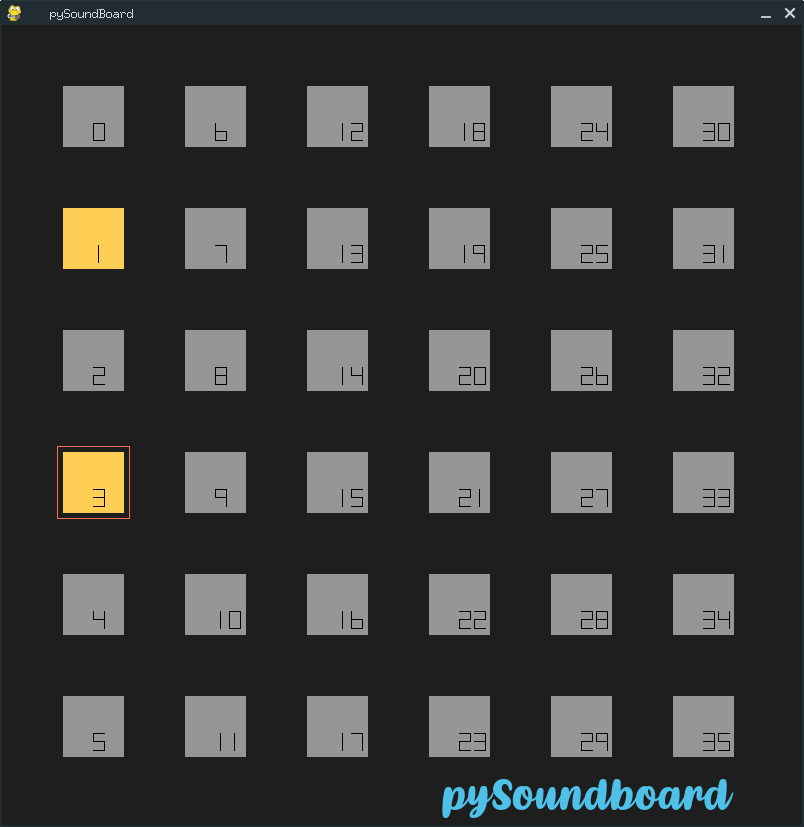

# pySoundBoard

* [Installing and executing the program](#installing-and-executing-the-program)
* [Usage](#usage)

`pySoundboard` is a simple Pygame sound board for adding sound effects while recording podcasts. The goal was to create something similar to [Farrago](https://rogueamoeba.com/farrago/) with the look and feel of a DJ control board.



## Installing and executing the program

Place your sounds in the sound folder. Edit the file named `paths.txt` to point to sound files (Some sample sounds have been included). The soundboard will read this file and load sounds accordingly. Run the following:

```bash
cd src
python3 soundboard.py
```
Buttons with sounds loaded will light in green. Buttons with no sounds loaded will remain in grey. When you hover a button an orange outline will appear. Finally when a sound is playing the button's color will stay in yellow color.

## Usage

* `Left Click` toggle Play/Stop
* `Right Click` Play with fade in (1s) / Stop with fade out (3s)
* `P` toggle Pause/Unpause all sounds
* `S` Stop all sounds
* `R` Reload all sounds
* `F` Fadeout all sounds (3s)
* `ESC` Exit
* `Alt`+`Click` To drag window (in Linux)

Enjoy!