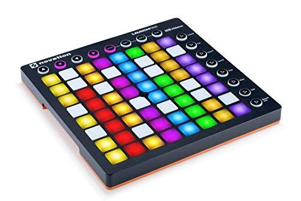

# pySoundBoard
A simple Pygame sound board for adding sound effects while recording podcasts.

## Goal
The goal is to create something similar to [Farrago](https://rogueamoeba.com/farrago/) with the look and feel of a DJ control board.

## Current Status

## Usage
* `P` toggle Pause/Unpause
* `S` Stop all sounds
* `F` Fadeout all sounds (3 seconds)
* `ESC` Exit